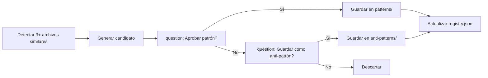

# Knowledge Pattern Engine

Gestiona el ciclo de vida completo de patrones de código: consulta antes de planificar, captura después de código aprobado, validación durante code review.

---

## Knowledge Base Structure

```
~/.config/opencode/knowledge/
├── patterns/          ← patrones probados (.md)
├── anti-patterns/     ← anti-patrones documentados
├── templates/         ← plantillas completas
└── registry.json      ← indice global
```

Cada patrón en `patterns/` es un archivo markdown con frontmatter YAML. Los anti-patrones siguen el mismo formato en `anti-patterns/`. Las plantillas en `templates/` contienen código esqueleto reutilizable.

---

## registry.json Schema

```json
{
  "$schema": "registry.schema.json",
  "version": "1.0.0",
  "last_updated": "2026-07-20",
  "patterns": [
    {
      "id": "pat-<uuid>",
      "title": "Nombre del patrón",
      "file": "patterns/<slug>.md",
      "stack": ["react", "typescript", "node"],
      "category": "architecture | component | hook | api | data-layer | testing",
      "confidence": 0.85,
      "usage_count": 12,
      "last_used": "2026-07-19",
      "source": "capture | manual | community"
    }
  ],
  "anti_patterns": [
    {
      "id": "anti-<uuid>",
      "title": "Nombre del anti-patrón",
      "file": "anti-patterns/<slug>.md",
      "stack": ["react"],
      "category": "architecture | component | state | testing",
      "severity": "error | warn",
      "detected_count": 3,
      "last_detected": "2026-07-18",
      "source": "capture | manual"
    }
  ],
  "templates": [
    {
      "id": "tpl-<uuid>",
      "title": "Nombre de plantilla",
      "file": "templates/<slug>.md",
      "stack": ["react", "typescript"],
      "category": "component | hook | service",
      "usage_count": 5,
      "last_used": "2026-07-15"
    }
  ]
}
```

### Campos comunes

| Campo | Tipo | Descripción |
|-------|------|-------------|
| `id` | string | Identificador único con prefijo semántico |
| `title` | string | Nombre legible del patrón |
| `file` | string | Ruta relativa dentro de `knowledge/` |
| `stack` | string[] | Stack tecnológico al que aplica |
| `category` | string | Clasificación funcional |

### Campos de patrón

| Campo | Tipo | Descripción |
|-------|------|-------------|
| `confidence` | float | 0.0–1.0, nivel de confianza en el patrón |
| `usage_count` | int | Veces que se usó con éxito |
| `last_used` | date | Última vez que se aplicó |
| `source` | string | Origen: captura automática, manual o comunidad |

### Campos de anti-patrón

| Campo | Tipo | Descripción |
|-------|------|-------------|
| `severity` | string | `error` → bloquea, `warn` → advierte |
| `detected_count` | int | Veces que se detectó |
| `last_detected` | date | Última detección |

---

## Modo 1: CONSULTA

### Cuándo
Antes de planificar o codificar: `phase_2_frontend`, `phase_2_backend`, `phase_3_coding`.

### Cómo
1. Leer `~/.config/opencode/knowledge/registry.json`
2. Filtrar patrones donde `stack` coincide con el proyecto actual (React, Node, Go, etc.)
3. Filtrar por `category` según la tarea (component, hook, api, data-layer, testing)
4. Ordenar por `confidence` descendente
5. Inyectar en el prompt del LLM como bloque de contexto

### Formato de inyección

```markdown
## [PATRON PROBADO] {title}
- **Categoría:** {category}
- **Confianza:** {confidence} (usado {usage_count} veces)
- **Regla:** {extracto del patrón}
- **Stack:** {stack}
```

Ejemplo real inyectado:

```markdown
## [PATRON PROBADO] Custom Hook con useReducer + Context
- **Categoría:** hook
- **Confianza:** 0.92 (usado 8 veces)
- **Regla:** Separar lógica de estado en hook use{Feature}Reducer, provider en componente dedicado,
  consumer vía hook use{Feature}Context. Nunca exponer el dispatch directamente.
- **Stack:** react, typescript
```

Si no hay patrones para el stack/categoría, continuar sin inyección (no bloquear).

---

## Modo 2: CAPTURA

### Cuándo
Después de código aprobado en `phase_3_5_review` cuando `CR >= 70`.

### Cómo
1. Analizar 3+ archivos en el mismo merge que comparten estructura similar
2. Extraer el patrón común:
   - **Imports:** conjunto de imports que se repite
   - **Hook structure:** llamadas a hooks en el mismo orden/patrón
   - **Component hierarchy:** wrapping, props spreading, composition idiomática
   - **Test patterns:** estructura describe/it, mocks, assertions
3. Generar candidate en markdown con frontmatter YAML

### Candidato generado

```markdown
---
id: pat-{uuid-auto}
title: "{nombre inferido}"
stack: [{stack inferido}]
category: "{categoría inferida}"
confidence: 0.60
usage_count: 0
source: "capture"
captured_from: ["{archivo1}", "{archivo2}", "{archivo3}"]
created: "{fecha}"
---

# {Título del Patrón}

## Contexto
{cuándo aplica este patrón}

## Estructura
{diagrama o descripción de la estructura}

## Código
```typescript
// código del patrón extraído
```

## Reglas
- {regla 1}
- {regla 2}

## Ejemplos
- {archivo1}: {qué demuestra}
- {archivo2}: {qué demuestra}
```

### Flujo de aprobación



Usar `question()` para cada candidato antes de persistir. Si el usuario rechaza, preguntar si debe registrarse como anti-patrón.

---

## Modo 3: VALIDACIÓN

### Cuándo
Durante code review en `phase_3_5_review`.

### Cómo
1. Para cada archivo nuevo/modificado en el merge:
   - Leer patrones relevantes de `registry.json` por stack
   - Comparar estructura del archivo contra cada patrón
   - Comparar contra anti-patrones conocidos
2. Generar sección en `code-review-report.md`

### Formato en code-review-report.md

```markdown
## Pattern Validation

### Patrones aplicados
| Archivo | Patrón | Match | Notas |
|---------|--------|-------|-------|
| src/hooks/useAuth.ts | Custom Hook + Context | ✅ 92% | Sigue el patrón establecido |
| src/components/LoginForm.tsx | Compound Component | ⚠️ 45% | Parcial — falta manejo de error consistente |

### Anti-patrones detectados
| Archivo | Anti-patrón | Severidad | Línea |
|---------|-------------|-----------|-------|
| src/store/userSlice.ts | Mutación directa de estado | 🔴 ERROR | L:23 |
| src/api/client.ts | Fetch sin timeout | 🟡 WARN | L:15 |

### Resumen
- ✅ Patrones seguidos: {count}
- ⚠️ Desviaciones leves: {count} (revisar, no bloquea)
- 🔴 Anti-patrones críticos: {count} (BLOQUEA merge)
```

**Reglas de severidad:**
- `severity: error` + match ≥ 80% → **BLOQUEAR** merge con FAIL
- `severity: error` + match < 80% → **WARN** en reporte
- `severity: warn` + cualquier match → **WARN** en reporte
- Patrón esperado con match < 50% → **WARN** ("desviación del patrón esperado {title}")

---

## Métricas y Confidence Scoring

### Estructura de confidence

```
confidence: 0.0 - 1.0
```

### Reglas de actualización

| Evento | Delta | Condición |
|--------|-------|-----------|
| Uso exitoso en CR (CR >= 70) | +0.05 | Una vez por CR, no por archivo |
| Reutilización en nuevo archivo | +0.02 | Por archivo que implementa el patrón |
| Deviation leve en CR | -0.05 | match ≥ 50% pero < 70% |
| Rechazo explícito del usuario | -0.15 | Usuario dice "no es patrón" |
| Anti-patrón detectado donde debía usarse | -0.25 | Se esperaba el patrón y se encontró anti-patrón |
| Floor | 0.10 | Nunca baja de 0.10 |
| Ceiling | 0.99 | Nunca sube de 0.99 |

### Umbrales de decisión

| Rango | Significado | Acción |
|-------|-------------|--------|
| 0.80 – 0.99 | Patrón sólido | Inyectar siempre en CONSULTA |
| 0.50 – 0.79 | Patrón emergente | Inyectar con marca "[EMERGENTE]" |
| 0.10 – 0.49 | Experimental | No inyectar automáticamente |

### Atributos adicionales en registry

```json
{
  "confidence_history": [
    { "date": "2026-07-01", "value": 0.75, "event": "capture" },
    { "date": "2026-07-10", "value": 0.80, "event": "successful_use" },
    { "date": "2026-07-15", "value": 0.70, "event": "deviation" }
  ]
}
```

`confidence_history` es opcional. Cuando existe, los últimos 3 eventos determinan la tendencia (↑ estable, ↓ degradándose, ↔ fluctuante) que se muestra en la inyección.

---

## Inicialización

Si `~/.config/opencode/knowledge/` no existe, crearla con estructura vacía:

```bash
mkdir -p ~/.config/opencode/knowledge/{patterns,anti-patterns,templates}
```

Y escribir `registry.json` inicial:

```json
{
  "version": "1.0.0",
  "last_updated": "{fecha_actual}",
  "patterns": [],
  "anti_patterns": [],
  "templates": []
}
```

No bloquear el flujo si el knowledge base está vacío. Simplemente omitir los modos CONSULTA y VALIDACIÓN hasta que exista al menos 1 patrón. El modo CAPTURA puede poblar la base desde 0.
